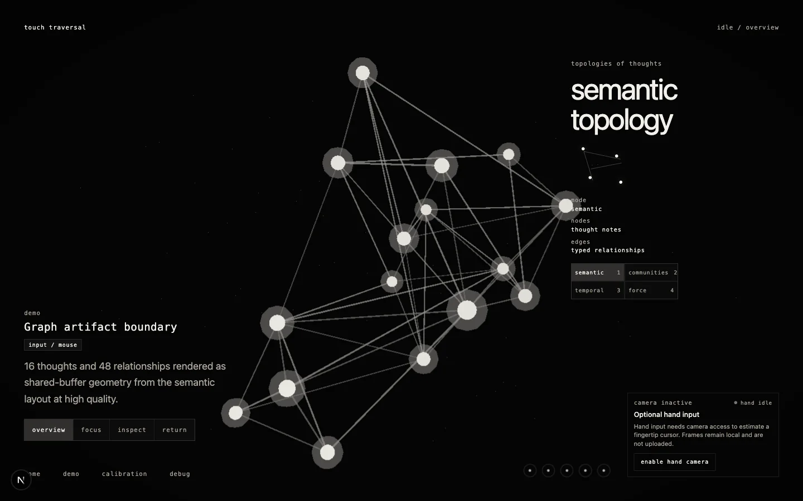
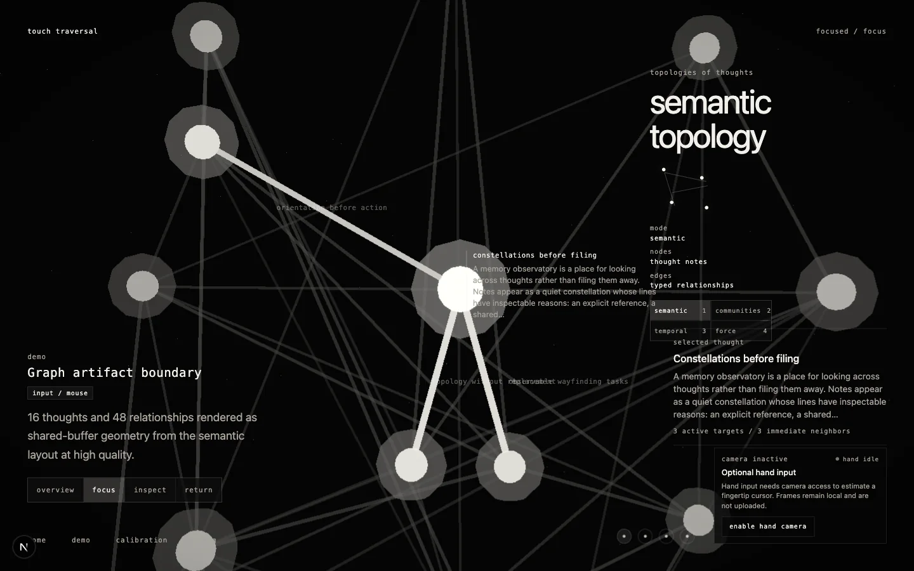
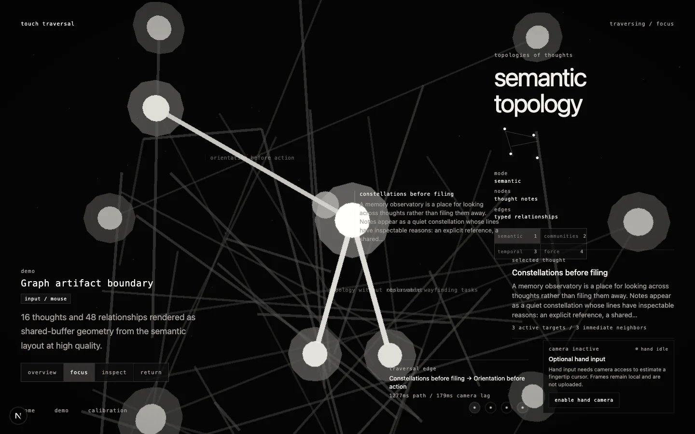
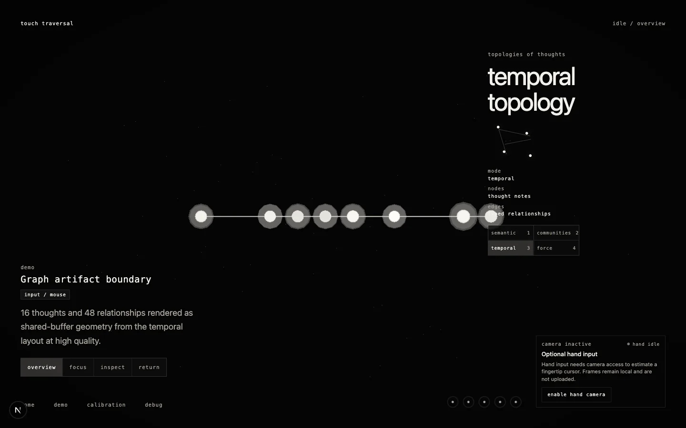
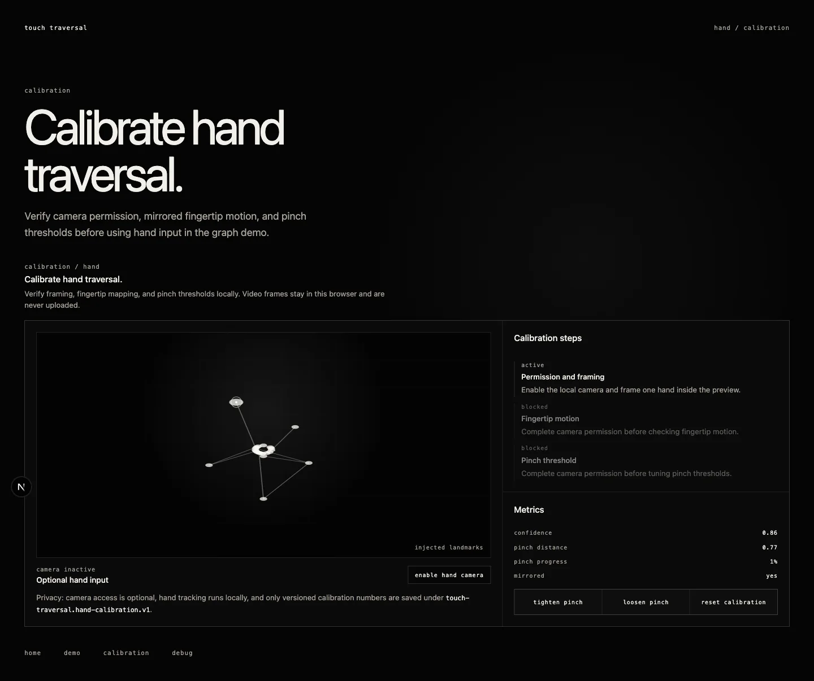

# Portfolio media

Captured on 2026-07-18 with Playwright-managed Chromium from the fictional public sample. Camera
permission stayed off for every capture; no camera background, personal note, or private frame is
present. Desktop stills use a 1440 × 900 CSS-pixel viewport unless noted otherwise.

## Showcase

Nine-frame, 9-second time-lapse sampled from the six beats of `/demo?recording=1`; 900 × 563,
300 KiB. For the authored real-time take, [watch the silent 26.52-second WebM](assets/portfolio/touch-traversal-demo.webm)
(1280 × 720, 2.45 MiB).

## Still gallery

### Overview

`/demo?input=mouse`, settled semantic overview; 1440 × 900, 50 KiB.

### Focused thought

`/demo?input=mouse`, focus settled on “Constellations before filing”; 1440 × 900, 75 KiB.

### Traversal

`/demo?input=mouse`, mid-traversal on an explainable neighbor edge; 1440 × 900, 78 KiB.

### Temporal topology

`/demo?input=mouse`, temporal morph settled; 1440 × 900, 32 KiB.

### Calibration

`/calibration`, camera inactive with deterministic injected landmarks; full-page output is
1440 × 1206 from a 1440 × 900 viewport, 47 KiB.
